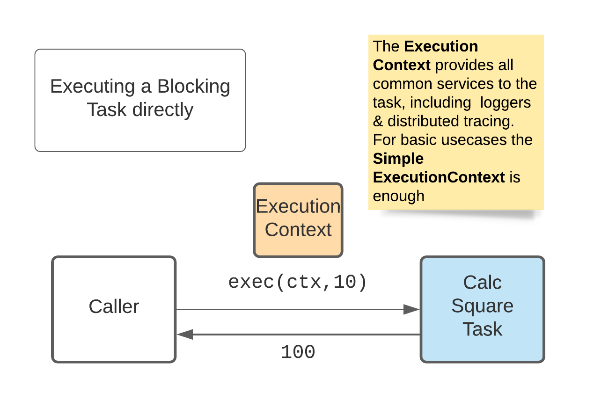

# Tasks

## Introduction

A `Task` is simply a basic building block that can encapsulate some useful activity, typically on an external system.
They have been developed to assist in the deployment of the Corda DLT platform and related systems, however the concepts
are useful in any situation where there multiple devops technologies to manage. They are NOT a replacement for tools
like Helm, Terraform and Ansible, but they do aim to simplify by replacing the adhoc scripting prevalent in these
solutions with simple API calls to the Lego like tasks.

A `Task` can be as simple or as complicated as necessary, though of course good design is almost certainly to build
complex tasks from a set of simpler ones. They can run anywhere there is a JVM installed.

To be truly useful, Tasks need a set of higher level services (todo - a link to what these are). We don't need to look
at these to understand how Tasks are built and work, but as with everything in [My Corda App](https://mycorda.app/)
these services are modular and built to the principle of minimal dependency.

## The Hello World task.

Every time a `Task` is run, it is allocated a unique id, the `taskId()`. This is used in logging and events. Strictly
speaking it is a taskInstanceId, but taskId is shorter

```kotlin
interface Task {
    //a unique ID created for each run of the Task
    fun taskId(): UUID
}
```

There are few "flavours" of `Tasks`. The simplest is a `BlockingTask`

```kotlin
interface BlockingTask<in I, out O> : Task {
    fun exec(ctx: ExecutionContext = SimpleExeccutionContext(), params: I): O
}
```

`ExecutionContext` is explained in more detail later. All we need to know to understand a Task is that it injects
information that is only known at execution time, such as the connection to a stdout console, as well as providing easy
access to common services.

All `Tasks` follow a simple Request / Response pattern with a single class for each input (Request) and output (
Response). This is important as:

* for higher level services it allows for a lot of generalisations
* it works very well with generics in Kotlin.

Tasks have three key characteristics:

* do one thing well
* provide stable and unambiguous inputs and outputs to their clients
* conform to the rules
  in [Really Simple Serializer](https://github.com/mycordaapp/really-simple-serialization/blob/master/README.md)

## Blocking Tasks

The most basic form is a `BlockingTask`. A simple example is below:

```kotlin
class CalcSquareTask : BaseBlockingTask<Int, Int>() {

    override fun exec(ctx: ExecutionContext, params: Int): Int {
        // this is normally the first line - it ensures the task is stored in the context
        val ctx = ctx.withTaskId(this)

        ctx.log("Calculating square of $params")
        return params.times(params)
    }
}
```

This doesn't really do anything useful, but it shows the basic programming model in which everything needed is available
via the `ExeccutionContext`.

## Executing a Task

A `Task` can be created and executed in three ways:

1. by instantiating an instance of the Task and calling the `exec` method directly.
1. by using the `TaskFactory`. Usually this is just part of the implementation of the `TaskClient` below
1. by creating a `TaskClient` and calling the `exec` method on the client. This is the preferred pattern as it:
    - allows for remoting (calling `Tasks` on a remote agent)
    - hides setup of the `ExecutionContext` from the caller
    - passes the security principles required for any authentication and downstream system access within the tasks. _
      note that currently this requirement is not well understood, however certain patterns are likely to occur - this
      is detailed later on_

`TaskDocExamples.kt` has full source code for the examples below.

### 1. Executing a Task directly



The `SimpleExeccutionContext` is lightweight and suitable for testing and simple use cases

```kotlin
@Test
fun `should call task directly`() {
    val task = CalcSquareTask()
    val ctx = SimpleExeccutionContext()
    val result = task.exec(ctx, 10)
    assertThat(result, equalTo(100))
}
```

### 2. Lookup a Task via the `TaskFactory`


This is usually part of the server side. It allows for dynamic registration of tasks

```kotlin
@Test
fun `should call task via the TaskFactory`() {
    // register a real task
    val liveFactory = TaskFactory()
    liveFactory.register(ListDirectoryTaskImpl::class, ListDirectoryTask::class)

    // create by class
    val taskByClass = liveFactory.createInstance(ListDirectoryTask::class)
    val ctx = SimpleExeccutionContext()
    assert(taskByClass.exec(ctx, ".").contains("build.gradle"))

    // create by name
    val taskByName =
        liveFactory.createInstance("mycorda.app.tasks.ListDirectoryTask") as BlockingTask<String, List<String>>
    assert(taskByName.exec(ctx, ".").contains("build.gradle"))

    // register and create a fake task
    val fakeFactory = TaskFactory()
    fakeFactory.register(ListDirectoryTaskFake::class, ListDirectoryTask::class)
    val fakeTask = fakeFactory.createInstance(ListDirectoryTask::class)
    assert(fakeTask.exec(ctx, ".").contains("fake.txt"))
}
```

### 3. Executing a Task via the `TaskClient`


This is the typical case as it reflects the usual client server model, with tasks invoked locally but running on another
agent of some form on another server. Note that for simplicity, in this example we create the `SimpleTaskClient` which
uses in memory communication.

```kotlin
@Test
fun `should call task via a task client`() {
    // 1. register a real task in the TaskFactory (server side)
    val taskFactory = TaskFactory()
    taskFactory.register(ListDirectoryTaskFake::class, ListDirectoryTask::class)
    val registry = Registry().store(taskFactory)

    // 2. get a task client (client side)
    val taskClient = SimpleTaskClient(registry)

    // 3. call the client
    val clientContext = SimpleClientContext()
    val result = taskClient.execBlocking<String, List<String>>(
        clientContext,
        "mycorda.app.tasks.ListDirectoryTask", "."
    )

    // 4. assert results
    assert(result.contains("fake.txt"))

    // 5. assert logging output
    assertThat(
        clientContext.inMemoryLoggingConsumerContext().stdout(),
        equalTo(
            "ListDirectoryTask:\n" +
                    "   params: .\n"
        )
    )
    assert(
        clientContext.inMemoryLoggingConsumerContext().messages()
            .hasMessage(LogLevel.INFO, "listing directory '.'")
    )
}
```

The example also shows another important characteristic of the design. Logging output from the Task (structured log
messages and stdout/stderr) are made available to the client, which can help greatly in debugging and fault detection.
The implementing task controls what is sent. Looking at the code for `ListDirectoryTaskFake` we can see this clearly.

This behaviour is in addition to any distributed logging that may be enabled, which is described later.

```kotlin
class ListDirectoryTaskFake : ListDirectoryTask, BaseBlockingTask<String, List<String>>() {
    override fun exec(executionContext: ExecutionContext, params: String): List<String> {
        val out = executionContext.stdout()
        out.println("ListDirectoryTask:")
        out.println("   params: $params")
        executionContext.log(LogMessage.info("listing directory '$params'"))
        return listOf("fake.txt")
    }
}
```

## Async Tasks

In most cases to build a robust application Async Tasks are needed. These manage three problems in distributed systems:

* It is usually unsafe to assume a Task will execute and respond quickly. Network latency, system failovers and the
  general inconsistency of timings on cloud platforms have to be considered.
* Both the client and server may restart while running a task
* It is safer to be pessimistic, and assume that any message between a client and server can be lost.

The Async Task version of CalcSquareTask is below.

```kotlin
class CalcSquareAsyncTask(registry: Registry) : AsyncTask<Int, Int> {
    private val resultChannelFactory = registry.get(AsyncResultChannelSinkFactory::class.java)
    private val taskId = UUID.randomUUID()
    override fun exec(
        ctx: ExecutionContext,
        channelLocator: AsyncResultChannelSinkLocator,
        channelId: UniqueId,
        input: Int
    ) {
        // 1. Find the channel
        val resultChannel = resultChannelFactory.create(channelLocator)

        ctx.executorService().submit<Unit> {
            // 2. Generate a result
            val result = AsyncResultChannelMessage(channelId, Success(input * input), Int::class.java)

            // 3. Simulate a delay 
            Thread.sleep(AsyncTask.platformTick())

            // 4. Write the result
            resultChannel.accept(result)
        }
    }
}

```

Breaking this code down:

and the basic test case is

```kotlin
 fun `should call task directly`() {
    // 1. Setup a result sink,
    val resultSinkFactory = DefaultAsyncResultChannelSinkFactory()
    val reg = Registry().store(resultSinkFactory)

    // 2. setup a channel for the results
    val locator = AsyncResultChannelSinkLocator.LOCAL
    val channelId = UniqueId.random()

    // 3. setup the task
    val task = CalcSquareAsyncTask(reg)
    val ctx = SimpleExecutionContext()

    // 4. call the task. The result will come back on the results channel
    task.exec(ctx, locator, channelId, 10)

    // 5. run a query over the result channel. In this
    //    CalcSquareAsyncTask is a demo and has returned a result immediately
    val query = resultSinkFactory.channelQuery(locator)

    // 6. assert expected results
    // not yet read
    assertThat(query.hasResult(channelId), equalTo(false))
    // wait long enough
    Thread.sleep(AsyncTask.platformTick() * 2)
    // now ready
    assert(query.hasResult(channelId))
    val result = query.result<Int>(channelId)
    assertThat(result, equalTo(Success<Int>(100) as AsyncResult<Int>))
}

```

## Modularising the `TaskFactory`

As described above, in most cases tasks will be created via a TaskFactory. However, there can only be a single
TaskFactory, and it must be wired up at runtime. This is a problem once modularity is considered. As an example there
might be a jar file containing tasks to manage K8s on AWS, another for K8s Azure and a third for a Corda 5 virtual node.
An agent would need to pull in multiple jars and ensure that for each the appropriate task are registered with the
TaskFactory. And if the jars also provide `fake` implementations on the tasks for use in tests, there needs to be a way
of deciding if the real tasks or the fakes are to be used.

The basic building block for managing this problem is `TaskRegistrations`, just a type safe list of task registrations.
Any jar module should include at least implementation (it is a design decision as to just how granular the breakdown is).

There is an example below: 

```kotlin
    // 1. setup some groups using SimpleTaskRegistrations - this emulates
    //    the TaskRegistrations exposed by one or more Jar files
    class CalculatorTasks : SimpleTaskRegistrations(
        listOf(TaskRegistration(CalcSquareAsyncTask::class), TaskRegistration(CalcSquareTask::class))
    )
    val calculatorTasksClazzName = CalculatorTasks::class.java.name

    class EchoTasks : SimpleTaskRegistrations(
        listOf(TaskRegistration(EchoStringTask::class), TaskRegistration(EchoIntTask::class))
    )


    // 2. register the groups
    val taskFactory = TaskFactory()
    // by clazzName - this emulates the scenario in which registrations are controlled by external configs
    taskFactory.register(TaskRegistrations.fromClazzName(calculatorTasksClazzName))
    // by instantiating an instance - this emulate the scenario of hard coded registrations
    taskFactory.register(EchoTasks())

    // 3. check the tasks can be created
    val ctx = SimpleExecutionContext()
    assertThat(taskFactory.createInstance(CalcSquareTask::class).exec(ctx, 10), equalTo(100))
    assertThat(taskFactory.createInstance(EchoStringTask::class).exec(ctx, "foo"), equalTo("foo"))
```

## Combining Tasks

**Work in progress**

The second principle is that is easy to call and combine tasks, even if the implementation is running on another server.
To support this there is prebuilt support for common problems including:

* creation of fully wired ExecutionContext
* serialisation of input and outputs
* 'executors' to encapsulate common patterns like logging, exceptions handling and retries
* building and securing servers running tasks

## Provisioners and Templates

**Work in progress**

The third principle is of Provisioners and Templates. Typically users will want to perform higher actions, for example
deploy a Corda Node to AWS with their apps pre-installed, without having to understand all the Tasks needed to
accomplish that goal. Provisioners simply take a predefined template (currently YAML or JSON) and use these rules to
drive calling the correct Tasks with required params. Written like this, it sounds simple. But in practice there must be
a fairly consistent set of rules that are followed when implementing a provisoner.

Provisioners can be constructed from prebuilt stages that define  
common steps. As an example, think of deploying a corda node that connects to Testnet to either Azure or AWS. Obviously
the steps that provision the VM on the cloud are different, but once past this stage the steps to configure the Corda
node (setting X500 name, overriding default settings, installing corDapps, joining Testnet, setting up unix systemctl to
run Corda, staring Corda, ... )
are the same.

### - Testing is built in

**Work in progress**

The final principle is testability. Mock/Fake implementation of Tasks must be provided for use in the test suites.

*todo - expand this principle*

 